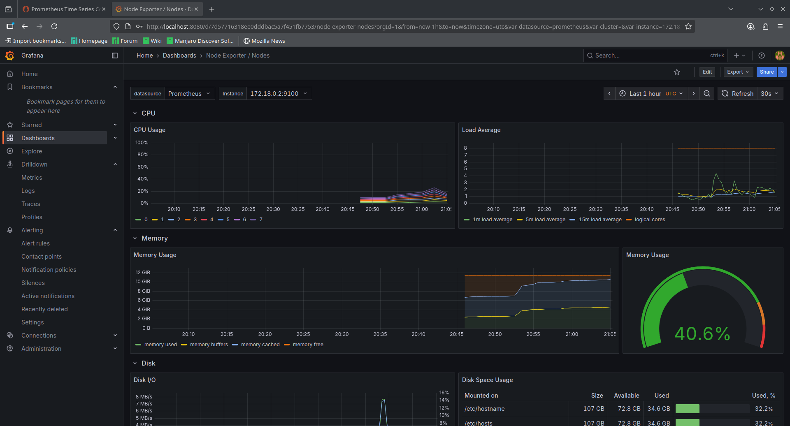
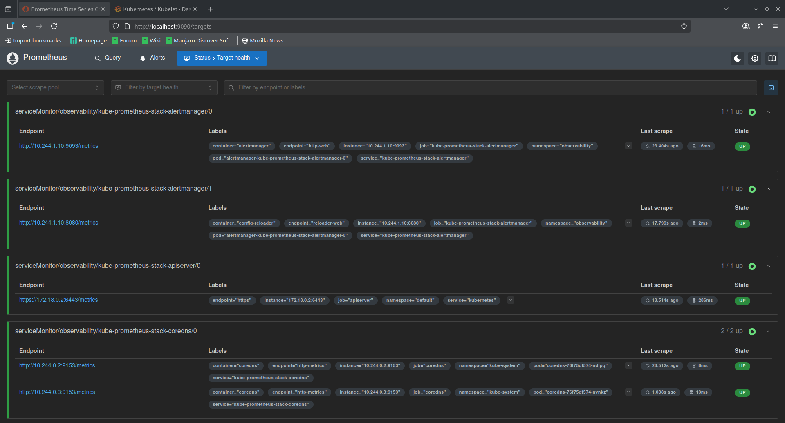
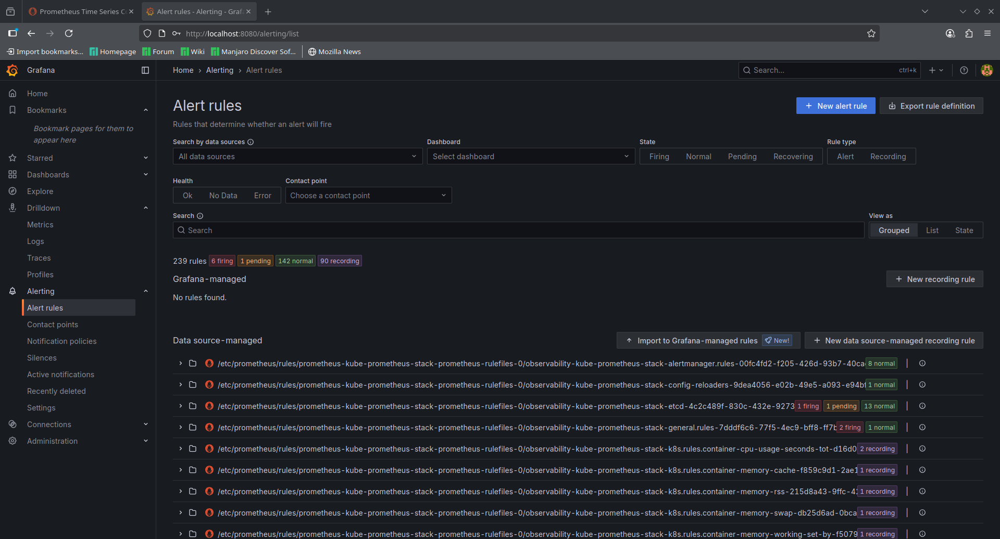

# GitOps with Flux and Terraform

This repository serves as the source of truth for a GitOps-managed Kubernetes environment powered by [Flux](https://fluxcd.io/) and configured using [Terraform](https://www.terraform.io/). It automates the continuous delivery of Kubernetes workloads through Git-based workflows.

**The main purpose of this project is to demoonstrate the installation of a gitops tool(flux) using iac**
## 📦 Overview

- **GitOps Tool:** [Flux](https://fluxcd.io/)
- **Infrastructure as Code:** [Terraform](https://www.terraform.io/)
- **Deployment Target:** Kubernetes Cluster (using kind)
- **Flux Installation:** Managed via Terraform
- **Repository Role:** Source of truth for Flux to reconcile Kubernetes manifests


## 📁 Structure

```text
.
├── iac/terraform/             # Terraform code to install Flux and configure the cluster
├── clusters/              # Cluster-specific configuration (e.g., overlays)
├── apps/                  # Application manifests (HelmReleases, Kustomizations, etc.)
└── README.md

```

## 📊 Observability Stack Installation

This project installs a full observability stack (Prometheus, Grafana, Alertmanager) using Flux and HelmRelease CRDs. The stack is deployed into the `observability` namespace and managed declaratively.

### How it works
1. **Namespace Creation:**
    - `namespace.yaml` creates the `observability` namespace.
2. **HelmRepository:**
    - `repository.yaml` defines the Helm chart source for kube-prometheus-stack from the Prometheus Community OCI registry.
3. **HelmRelease:**
    - `release.yaml` deploys the kube-prometheus-stack chart, specifying chart version and release settings.
4. **Kustomization:**
    - `kustomization.yaml` ties together the observability manifests for deployment.
5. **Images & Dashboards:**
    - Visuals and dashboards are stored in `assets/diagrams/projects/gitops-with-flux/observability-dashboards/` and referenced in documentation for monitoring and alerting setup.

#### Example HelmRelease CRD
```yaml
apiVersion: helm.toolkit.fluxcd.io/v2beta1
kind: HelmRelease
metadata:
  name: kube-prometheus-stack
  namespace: observability
spec:
  chart:
    spec:
      chart: kube-prometheus-stack
      version: 77.0.x
      sourceRef:
        kind: HelmRepository
        name: kube-prometheus-stack
  releaseName: kube-prometheus-stack
  targetNamespace: observability
```

#### Example Images
- 
  *Shows real-time metrics for Kubernetes nodes, including CPU, memory, disk, and network usage. Useful for monitoring node health and resource utilization.*
- 
  *Displays the status of Prometheus scrape targets, indicating which services and endpoints are being monitored and their health.*
- 
  *Visualizes configured alert rules in Grafana, helping track active alerts and their conditions for proactive incident response.*

---

**This Documentation was generated with the help of AI**
